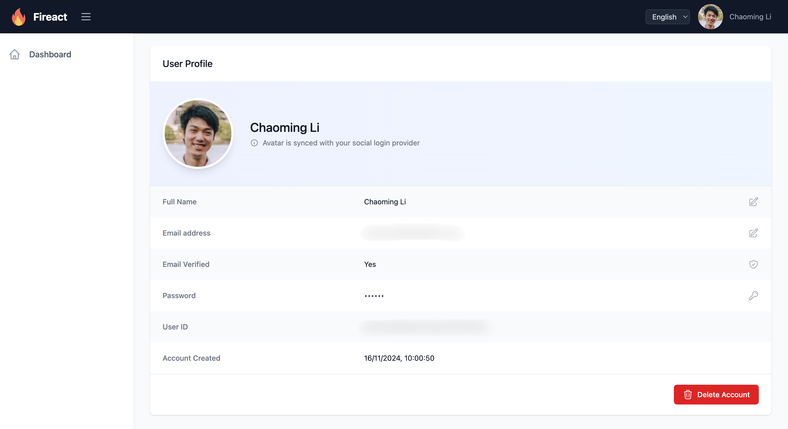

# @fireact.dev/core Demo

This is a demonstration repository for the [@fireact.dev/core](https://www.npmjs.com/package/@fireact.dev/core) package, which provides essential components and utilities for building Firebase-powered React applications.

## Key Features

The @fireact.dev/core package offers:

- **Authentication Components**: Pre-built components for sign-in, sign-up, password reset, and protected routes
- **User Management**: Complete user profile management including name/email editing, password changes, and account deletion
- **Social Login Integration**: Support for multiple social authentication providers (Google, Microsoft, Facebook, Apple, GitHub, Twitter, Yahoo)
- **Internationalization**: Built-in i18n support with language detection and switching capabilities
- **Responsive Layouts**: Ready-to-use authenticated and public layouts with desktop/mobile navigation
- **Firebase Integration**: Seamless Firebase setup with emulator support for local development

## Live Demo

Experience these features in action by visiting our live demo site:
https://fireact.dev/demos/

## Documentation

Learn how to build your own web application using @fireact.dev/core:
https://docs.fireact.dev/core/
